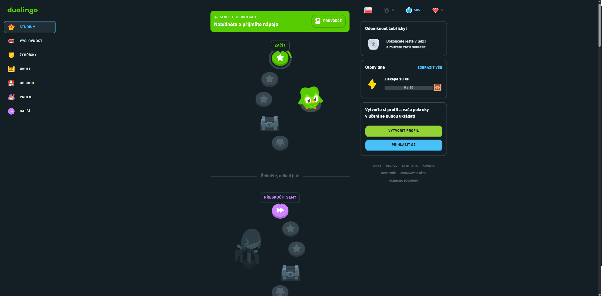
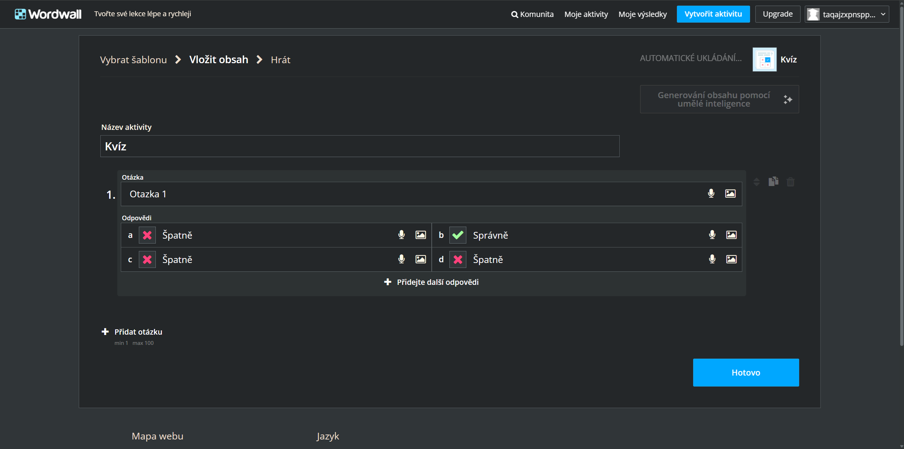
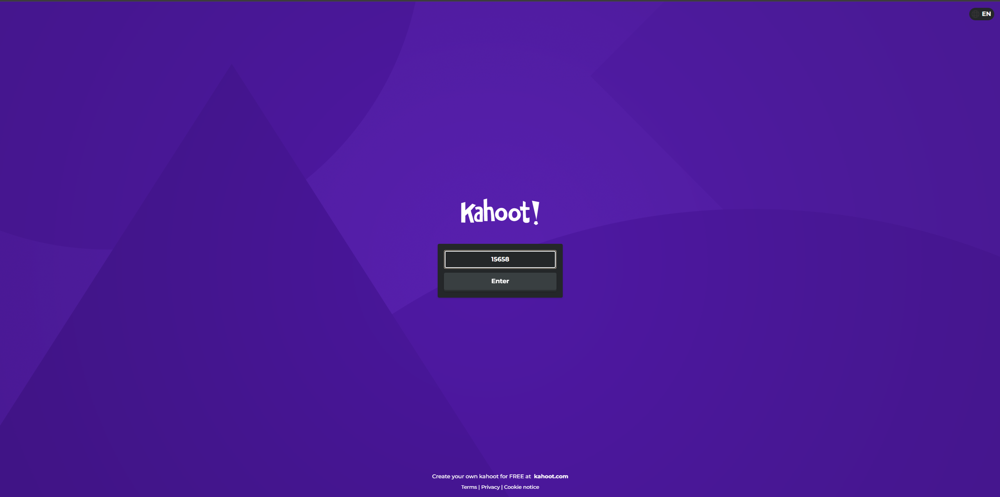
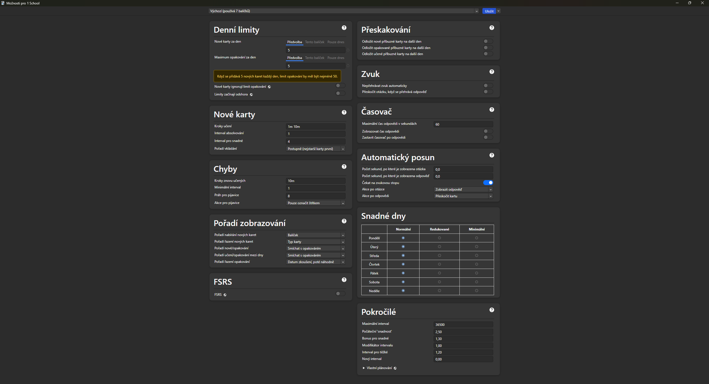
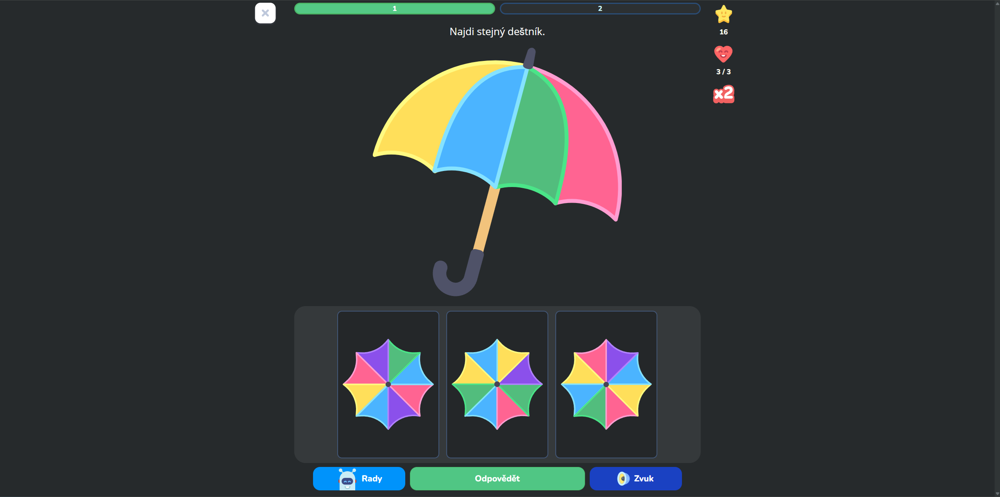
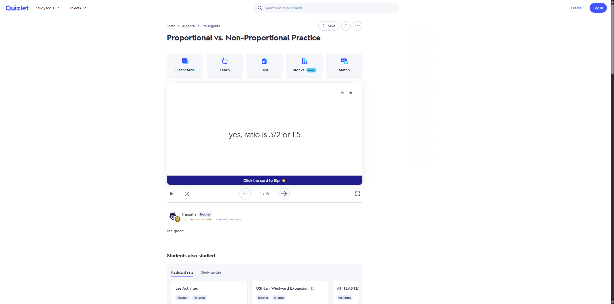
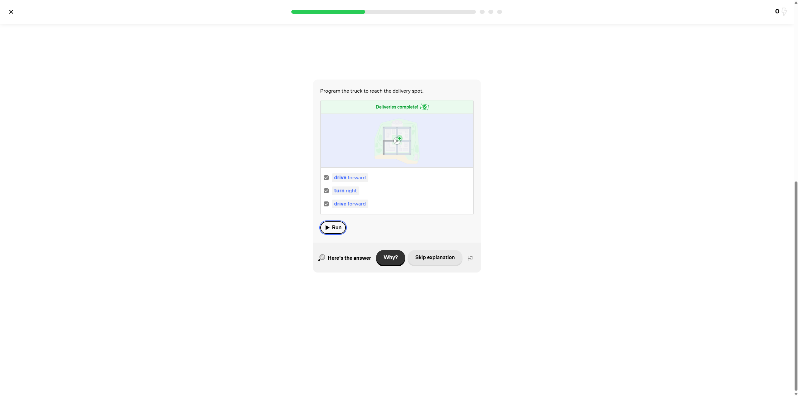

# Cílem Práce

Cílem této práce je vytvořit uživatelsky multiplatformní (Windows, Linux, Android (možná) a IOS(možná)) přivětivý nástroj pro procvičování učiva, který by umožnil učitelům vytvářet snadným způsobem interaktivní studijní materiál. Z interaktivních materiálů by se mohli učit studenti. Jednalo by se o webovou aplikaci (toto ještě nemám promyšlené).

# Související práce

Využijeme existující řešení pro přístup k interaktivnímu učení a nalézt a vytvořit lepší přivětivý nástroj pro pročvičování učiva. 

### Duolingo

Duolingo je nástroj pro procvičování cizích jazyků, který se snaží motivovat uživatele se učit ze studijních materiálů za pomocí herních mechanik - skóre, žebříčky, odznaky, mapa levelů... Díky ní uživatel je více aktivnější a lépe se mu učí. 

Výhody:

- Je uživatelsky přivětivé
- Jednoduchý a hezký design uživatelského rozhrání
- Herní prvky a adaptativní učení

Nevýhody:

- Neschopnost vytvářet vlastní vyúkový materiál 
- Pouze pro výuku jazyků
- Kurzy jsou pevně dané společností
- Nutnost být přihlášen/registrován 

Tento nástroj se hlavně soustředí na herní prvky pro procvičování učiva, tím bychom se mohli inspirovat pro vytvoření našeho nástroje pro učiva. Líbí se mi styl, jak se snaží namotivovat své uživatele, aby se více učili. Jediné, co mi přijde škoda, že je pouze pro jazyková učiva a bylo by dobré, aby se mohlo týkat jiných témat, např. matematika.

Ukázka herních prvků
 

### WordWall

Wordwall je nástroj pro tvorbu interaktivních materiálů, které umožnuje učitelům vytvářet materiály a sdílet cvičení svým studentům. Pro vytváření cvik se použivají šablony, např. kvízy, křížovky, spojovačky, atd... 

Výhody:

- Schopnost vytvářet vlastní výukový materiál 
- Tvorba cvik za pomocích šablon
- Několik existujících šablon pro vytváření materiálů

Nevýhody:

- Uživatelsky nepřivětivé
- Nutnost být přihlášen/registrován 

Tento nástroj se hlavně soustředí na vytváření interaktivního materiálu za pomocí šablon a její sdílení.Tím bychom se mohli inspirovat pro vytvoření našeho nástroje, zkusit vymyslet nějaký jednodušší nebo flexibilnější způsob tvorby interaktivního učiva. Libí se mi styl, jakým způsobem se vytváří materiál. Jediné, co mi přijde škoda, je složitý a nehezký design uživatelského rozhrání.

Ukázka vytváření kvízu pomocí šablony
 

### Kahoot!

Kahoot je interaktivní nástroj, který umožnuje učitelům vytvářet a spouštět kvízy v reálném čase. Studenti se mohou pak připojit a soutěžit mezi sebou.

Výhody:

- Je uživatelsky přivětivé
- Herní prvky
- Možnost propojení několika studentů v jednom okamžiku za pomocí kódu
- Studenti nemusí být registrovaní

Nevýhody:

- Pouze podpora kvízů 
- Nutnost být přihlášen jako tvůrce

Tento nástroj se hlavně soustředí na propojení několika studentů, aby navzájem soutěžili. Tím bychom se mohli inspirovat pro vytvoření našeho nástroje, zkusit vymyslet nějaký způsob propojení několika studentů. Libí se mi, jakým způsobem řeší propojování studentů.

Ukázka připojování studentů k danému kvízu pomocí číselného kódu
  

### Anki

Anki je nástroj pro zapamatování informací pomocí opakování na základě algoritmu rozloženého učení pomocí flash kartiček, které uživatel vytvořil. Učit se lze offline.  

Výhody:

- Je uživatelsky přivětivé
- Adaptativní učení
- Možnost offline učení

Nevýhody:

- Pouze podpora flash kartiček
- Nutnost ručního nastavování algoritmu

Tento nástroj se hlavně soustředí na adaptativní učení a možnost se učit kdekoliv na světě bez připojení k internetu. Mohli bychom se inspirovat offline podporou a adaptativním učením.

Ukázka nastavení adaptativního učení pro procvičování kartiček
  

### LogicLike

LogicLike je nástroj pro logické myšlení. Snaží se do cvičení zapojovat obrázky jako odpovědi.  

Výhody:

- Je uživatelsky přivětivé
- Možnost odpovídat za pomoci obrázků

Nevýhody:

- Zaměřeno pouze pro děti
- Nutnost být přihlášen jako tvůrce

Tento nástroj se hlavně soustředí na uživatelskou přivětivost, podporuje přidávání odpovědí formou obrázků místo textu. Mohli bychom se inspirovat k vizuálnímu zpracování, jednoduchosti ovládání a podporou obrázků jako odpovědí. 

Ukázka použití obrázků jako odpovědi
  

### Quizlet

Quizlet je nástroj pro vytváření kartiček, pexesa,... na základě jednoho zdroje dat.

Výhody:

- Možnost vytvářet kartičky, pexeso,... na základě jednoho zdroje dat
- Import/export přes formát
- Je uživatelsky přivětivé

Nevýhody:

- Je zčásti placená
- Nutnost být přihlášen jako tvůrce

Tento nástroj se hlavně soustředí na vytváření různých typů cvičení na zakladě jednoho zdroje dat, např. csv a na základě toho se vytvoří cvičení, která podporuje. Mohli bychom se inspirovat tak, že některá cvičení budou podporovat daný formát a mohl by být použit pro jiný typ cvičení, např. z kvízu do spojovačky.

Ukázka použití jednoho zdroje dat pro typ cvičení kartiček
  

### Brilliant

Brilliant je nástroj k procvičování různých oborů z matematiky, informatiky, fyziky, atd. Soustředí se na již vytvořený materiál z několika různých oborů a na základě toho vytváří unikátní interaktivní cvičení.

Výhody:

- Je uživatelsky přivětivé
- Adaptativní učení
- Částečná možnost offline učení

Nevýhody:

- Nutnost být přihlášen

Tento nástroj se hlavně soustředí na pročvičování několika různých oborů za pomocí unikátních druhů cvičení. Mohli bychom se inspirovat, tak že bychom vytvořili nějaká cvičení, která nejsou generická - kvízy, spojovačky, atd. nebo vymyslet nějaký způsob, jak si učitel může naprogramovat vlastní typ cvičení, aby to pro něho nebylo složité.

Ukázka unikátního cvičení, kde uživatel programuje auto, aby se dostalo do cíle za pomoci vytvořených příkazů
  

## Porovnání existujících nástrojů

| Funkce                    | Duolingo | WordWall | Kahoot! | Anki    | LogicLike  | Quizlet | Brilliant   |
|---------------------------|----------|----------|---------|---------|------------|---------|-------------|
| Uživatelská přívětivost   | ano      | ne       | ano     | částečně| ano        | ano     | ano         |
| Herní prvky               | ano      | ne       | ano     | ne      | částečně   | částečně| ano/částečně|
| Adaptativní učení         | ano      | ne       | ne      | ano     | ne/částečně| ano     | ano         |
| Offline použití           | ne       | ne       | ne      | ano     | ne         | ne      | částečně    |
| Možnost vytvářet obsah    | ne       | ano      | ano     | ano     | ne         | ano     | ne          |
| Zaměření na více oborů    | ne       | ano      | ano     | ano     | částečně   | ano     | ano         |
| Společnost vytváří cvičení| ano      | ne       | ne      | ne      | ano        | ne      | ano         |
| Nutnost registrace        | ano      | ano      | ano     | ne/ano  | ano        | ano     | ano         |
| Sdílení materiálu         | ne       | ano      | ano     | ano     | ne         | ano     | ne          |
| Možnost tvorby materiálů  | ne       | ano      | ano     | ano     | ne         | ano     | ne          |
| Šablony pro tvorbu        | ne       | ano      | částečně| ne      | ne         | částečně| ne          |
| Propojení v reálném čase  | ne       | ne       | ano     | ne      | ne         | ne      | ne          |
| Týmová práce              | částečně | ne       | ne      | ne      | ne         | ne      | ne          |
| Různé typy cvičení        | částečně | ano      | ne      | ne      | částečně   | částečně| ano         |
| Export cvičení přes formát| ne       | ne       | ne      | ano     | ne         | ano     | ne          |
| Import cvičení přes formát| ne       | ne       | ne      | ano     | ne         | ano     | ne          |
| Dočásné linky pro cvičení | ne       | ne       | ano     | ne      | ne         | ne      | ne          |

## Shrnutí

Na základě existujících řešení bych byl rád, aby umělo:

- Tvorba cvičení za pomocí šablon (WordWall)
- Různé typy cvičení (Kvízy, spojovačky, flash karty nebo nějaké vlastní neexistujicí cvičení, např. mě napadlo, že by mohla být rytmická hra, např. (osu!), kdy student bubnuje na správné odpovědi a hraje na pozadí hudba, ale to by se mohlo později promyslet)
- Herní prvky (mapa levelů, žebříčky nebo soutěž)
- Možnost učení offline + online (např. stáhnout daný materiál)
- Není nutnost být přihlašen, stačí vytvořit nějaký link, který vydrží na pár dní nebo vymyslet nějaký způsob. Dále zabránit zneužívání linků. Promyslet to.
- Importovat cvičení přes formát - řešení pro omezené linky
- Export cvičení přes formát - řešení pro omezené linky
- Sdílení cvičení
- Podpora více platforem
- Možnost propojení více studentů v reálném čase

O případných dalších rozšířeních bych se chtěl domluvit. 

# Actors

Nástroj by byl určen pro studenty, učitele. Případně by z toho mohl vzniknout nástroj pro větší publikum, které se chce vzdělávat (např. Duolingo). 

# Open source

Často jsem si všimnl, že tyto nástroje jsou placené a bylo by dobré udělat z toho open source nástroj, aby si kdokoliv mohl vytvářet vlastní aplikaci nebo ji rozšířit.

Bylo by také dobré vytvořit nějaký systém, který by umožnil jiným firmám toto již hotové řešení použít a rozšířit si ji pro vlastní potřebu. Např. školní aplikace.

# Knihovny

Podle dohody ohledně projektu, začnu hledat knihovny, které se budou hodit pro moje funkce pro nástroj.

Zatím jsem si našel:

Front End:

- React
- Vue.js

Backend:
V backend části by se řešilo propojováná hráčů, vytváření dočasných linků a herní prvky.

- Node.js + Typescript
Správce knihoven:
- npn
- yarn

nebo

- C# + ASP.NET Core
Knihovna SignalR, která by zajistilo real time připojení několika studentů.

Nejlépe bych šel do C# z důvodu, že se budou využívat herní prvky, vytváření šablon a na to bude vhodnější použít C#.

Databáze:
- MongoDB
Databáze by běžela na MongoDB kvůli možnosti si ukládat data jako JSON dokument. Bylo by to výborné pro ukládání statistiky hráčů nebo jejich profilů.

Nasazení:
- Docker
- YAML s docker

Z důvodu přenositelnosti

Offline verze:
- PWA
Offline verze procvičování cvičení. Fungovalo by to pro předem vytvořené stránky, které by se chovali, jako samostatná aplikace. Něco podobnému her, které si uživatel může nakoupit a spustit si ji.

Další knihovny zatím budu hledat

# Analýza Systému

## Funkční požadavky

### Tvorba cvičení za pomocí šablony

Jako učitel chci mít možnost vytvářet cvičení pomocí předdefinovaných šablon, abych mohl snadno připravovat cvičení pro studenty.

Scénář:

Actors:
Učitel

Předpoklady:
1. Učitel má přístup k aplikaci
2. Učitel je v režimu vytváření cvičení
3. Aplikace obsahuje alespoň jednu šablonu pro vytvoření cvičení

Základní průběh
1. Učitel zapne aplikaci
2. Učitel zapne možnost vytváření cvičení
3. Aplikace zobrazí typy cvičení
4. Učitel zvolí typ cvičení - jedno cvičení
5. Aplikace zobrazí šablony pro vytvoření cvičení
6. Učitel vybere jednu šablonu pro vytvoření typu cvičení - kvíz
7. Aplikace zobrází obsah úloh dle vybrané šablony
8. Učitel vyplní obsah do vybrané šablony
9. Učitel potvrdí vytvoření cvičení
10. Aplikace uloží vytvořené cvičení
11. Aplikace zobrazí možnosti po vytvoření cvičení, co se má dělat - sdílení, export, link

Alternativní průběh:

8A. Učitel nezadá obsah do vybrané šablony
8A1. Aplikace ukončí vytváření cvičení

Následné podmínky:
1. Vytvořené cvičení je uloženo v databázi aplikace
2. Cvičení je připraveno ke sdílení
3. Cvičení je připraveno k exportu
4. Cvičení je připraveno k možným úpravám

### Sdílení cvičení

Jako učitel chci mít možnost sdílet svá cvičení za pomocí odkazů, aby se studenti mohli k cvičení jednoduše dostat bez složitého vyhledávání.

### Týmový režim

Jako učitel chci umožnit studentům spolupracovat na cvičení, aby se podpořila týmová práce a kooperativní učení.

### Adaptivní učení

Jako student chci, aby mi aplikace častěji předkládala látku, kterou neumím, abych se mohl zlepšovat tam, kde mám nedostatky.

### Offline režim

Jako student chci mít možnost používat aplikaci bez připojení k internetu, abych se mohl učit kdykoli a kdekoli.

### Multiplatformní nástroj

Jako student nebo učitel chci mít možnost používat aplikaci na různých zařízeních, abych k ní měl přístup bez ohledu na platformu.

### Bez registrace

Jako student chci mít možnost používat aplikaci bez použití účtu, abych se mohl okamžitě zapojit do výuky bez nutnosti vytvářet účet.

### Export cvičení přes formát

Jako učitel chci mít možnost vytvořené cvičení exportovat přes formát, abych je mohl zálohovat nebo použít v jiné aplikaci.

### Import cvičení přes formát

Jako učitel chci mít možnost použít vytvořené cvičení v daném formátu přes jinou aplikaci, naimportovat do aplikace Znalostník, abych mohl využít již existující materiály i v aplikaci Znalostník.

### Propojení více studentů v reálném čase

Jako učitel chci mít možnost propojení studentů v reálném čase na dané cvíčení, abych mohl řídit průběh výuky a sledovat pokrok během hodiny.

### Vytvoření herních prvků k cvičení

Jako učitel chci mít možnost přidat herní prvky ke cvičení, abych zvýšil motivaci studentů při učení.

## Nefunkční požadavky

### Dostupnost aplikace

Aplikace musí být dostupná uživateli vždy, aby se zabránilo nedostupnosti výuky cvičení.

### Podpora jazyka

Aplikace musí být v češtině s možností snadného přidání dalšího jazyka, aby se mohlo rozšířit do více zemích.

### Škálovatelnost

Aplikace musí zvládnout libovolný počet rostoucích uživatelů a cvičení bez ztráty výkonu.

### Rozšířitelnost

Aplikace musí zvládnout přidávání nových typů cvičení, rozhrání a nástroje, aby se mohly vyučovat nové obory, které potřebují daný typ cvičení.

### Nízká latence propojení více studentů v reálném čase

Aplikace musí zvládnout odpovídat na požadavky od studentů v realném čase do 1s, aby byla zajištěna plynulá výuka cvičení.

### Responzivní design

Aplikace musí přizpůsobovat uživatelské rozhrání na různých zařízeních, aby bylo zajištěno multiplatformní použití.

### Testovatelnost

Aplikace musí být pokryta automatickými testy, aby bylo možné rychle ověřit správnou funkcionalitu při změně kódu.

### Podpora formátů

Aplikace musí zvládnout podporovaný formát daného typu cvičení, exportovat nebo importovat, aby se mohlo vytvářet cvičení v jiné aplikaci něž v Znalostník.

## Architektura aplikace

### Analýza stylů architektury

Pro návrh nástroje Znalostník, který slouží k vytváření a procvičování cvičení, jsem zvolil čtyři architektonické styly. Výběr byl proveden na potřeby funkčních a nefunkčních požadavků aplikace.

Proč byly tyto styly vybrány:

#### Layered

Tento styl byl vybrán jako výchozí možnost, protože je jednoduchý na vývoj. 

#### Event-Driven

Tento styl byl vybrán pro scénáře, kde uživatel často interaguje s aplikací, např. při výběru odpovědí u kvízu. Dále by se hodil pro vytváření cvičení za pomoci šablon, kdy uživatel často kombinuje, např. počet možných odpovědí na danou otázku.

#### Modulární monolit

Tento styl byl vybrán, protože umí rozdělovat odpovědnosti aplikace na několik malých modulů, které se mohou vyvíjet nezávisle a lze je navzájem propojovat. Jedná se o lepší způsob Layered stylu.

#### Service-Based

Tento styl byl vybrán, protože umožňuje oddělit části systému jako samostatné služby, které spolu komunikují přes definovaná rozhraní. Pro Znalostník by se využil zejména při tvorbě komplexních cvičení. Např. výběr typu cvičení by se bral jako samostatná služba, výběr šablony jako samostatná služba. Pak za pomocí těchto služeb by se mohly kombinovat různé typy režimy vytváření cvičení: např. režim pro vytvoření jednoho cvičení by byla použita pouze služba výběru šablony, pro režim vytváření herní mapy by se použili služby: výběr šablony a výběr typu cvičení.

| Funkční požadavky                       | Layered  | Event-Driven | Modulární monolit | Service-based  |
|-----------------------------------------|----------|--------------|-------------------|----------------|
| Tvorba cvičení přes šablony             | ---      | ---          | ---               | ---            |
| Sdílení cvičení pomocí odkazu           | ---      | ---          | ---               | ---            |
| Týmový režim                            | ---      | ---          | ---               | ---            |
| Adaptivní učení                         | ---      | ---          | ---               | ---            |
| Offline režim                           | ---      | ---          | ---               | ---            |
| Multiplatformní nástroj                 | ---      | ---          | ---               | ---            |
| Použití bez registrace                  | ---      | ---          | ---               | ---            |
| Export & Import cvičení                 | ---      | ---          | ---               | ---            |
| Propojení studentů v reálném čase       | ---      | ---          | ---               | ---            |
| Herní prvky                             | ---      | ---          | ---               | ---            |
| Rozšířitelnost                          | ---      | ---          | ---               | ---            |
| Testovatelnost                          | ---      | ---          | ---               | ---            |
| Složitost implementace                  | ---      | ---          | ---               | ---            |

### Shrnutí

Na základě analýzy stylů architektury bude vybrán styl: ______________________, protože nejvíce vyhovuje všem požadavkům. 
